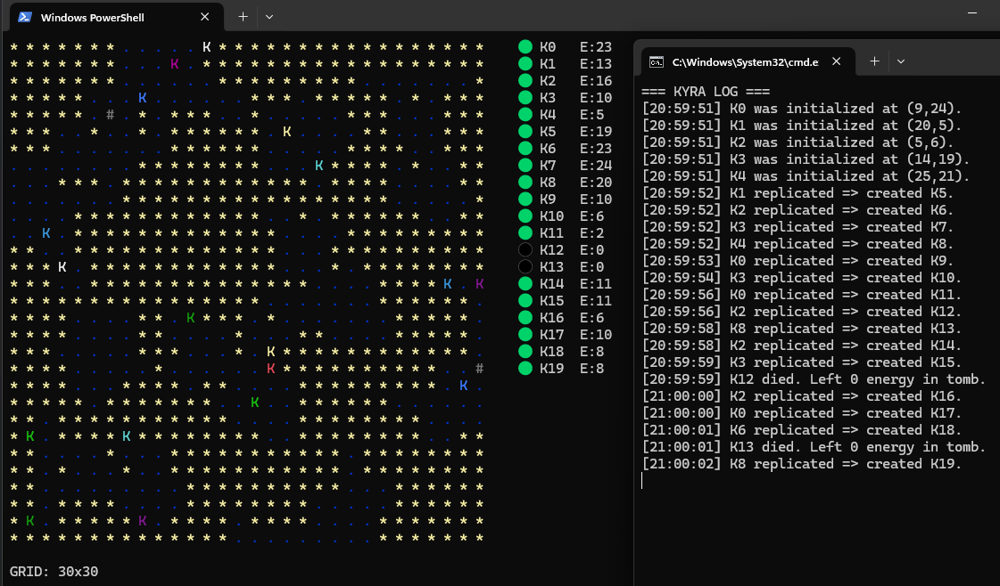
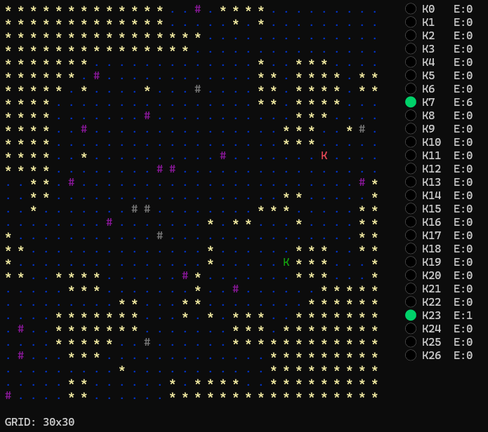
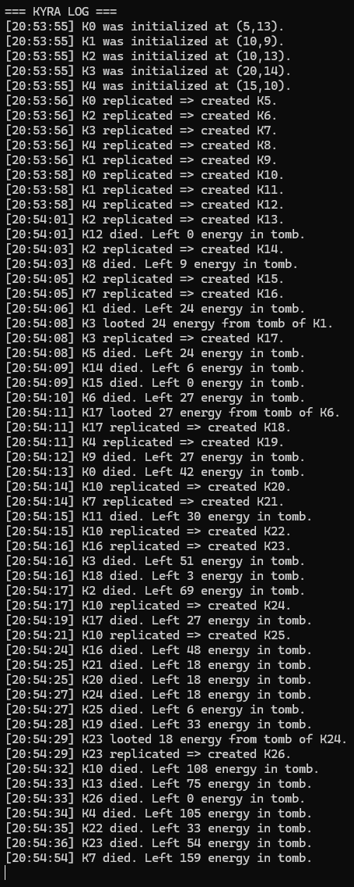
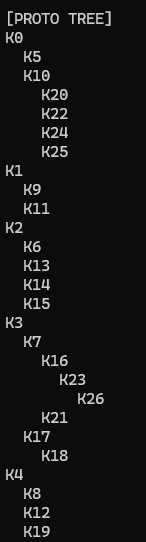

# Kyra Simulation

**Kyra** is an experimental terminal-based artificial life simulation.  
It's a simple ASCII world where digital organisms try to survive, replicate, and die with meaning. Or at least with color.

---

## 🧠 What Is This?

Kyra simulates primitive digital organisms navigating a 2D world. Each Kyra has simple instincts: gather energy, replicate when strong, and leave behind tombs when they die.

This is an early-stage project—Kyra is still learning to crawl. It doesn’t aim to replicate biology, but plays with ideas of self-replication, decay, and emergence.

---

## 📜 Rules of Kyra Life

Kyra's world runs on a few simple rules. No gods, no kings—just instincts and if-statements.

1. **Consume to Exist.**  
   Kyras must stand on an energy cell to consume it. No remote dining. If there’s fuel, they slurp it. If not, they starve.

2. **You Move, You Pay.**  
   Every step costs 1 energy. Motion is taxation. Standing still is free (but not advised).

3. **Replicate When Strong.**  
   With enough energy (≥ 25), a Kyra tries to clone itself into an adjacent empty tile. Reproduction is their only career goal.

4. **Death Is Energy Redistribution.**  
   When a Kyra dies, it leaves behind all the energy it ever collected. It's poetic, if you’re into tragic minimalism.

5. **Loot Thy Ancestors.**  
   Living Kyras can absorb energy from neighboring tombs. Yes, grave-robbing is both allowed and encouraged. This is survival.

6. **You Shall Not Step on a Tomb.**  
   Mezarlar kutsal. Kyras cannot walk on tombs. It’s tradition, code, and good manners.

7. **No Diagonal Shenanigans.**  
   All movement and interaction is strictly up/down/left/right. This isn’t a tactical RPG.

8. **Energy Is Life.**  
   No energy? No Kyra. They don’t cry, they just stop existing.

---

## ✨ Features (so far)

- Simple AI: Kyras move, replicate, and perish based on energy
- Tombs retain the total lifetime energy gathered by the deceased
- Other Kyras can scavenge tombs for survival
- Fully energy-populated grid (or random placement)
- Live terminal interface with colored rendering
- Logs printed in a secondary terminal window (on Windows) or to file

---

## 🖼 Screenshots

| Simulation | Log View | Lineage Tree |
|------------|-----------|---------------|
|  |  |  |

---

## 📦 Run It

dotnet run

---

## 💡 Inspiration

Kyra started as a curiosity: could digital life emerge from very simple rules? Inspired by cellular automata and artificial life experiments, this simulation explores the tension between order and entropy, inheritance and extinction, movement and meaning.

---

## 🧰 Tech Stack

- **Language:** C# (.NET 7+)
- **Environment:** Terminal (cross-platform)
- **Rendering:** ASCII-based, color-coded with `Console.ForegroundColor`
- **Logging:** Real-time logs to `log.txt`, viewed in external terminal (Windows) or tail (Linux/macOS)

---

## 🚧 Development Status

This is an evolving playground for digital life ideas. The simulation currently lacks:
- Long-term memory
- Mutation
- Adaptation
- Pathfinding
- Environmental change

It is expected to grow into something richer... or collapse beautifully.

---

## 🌱 Coming Soon / Ideas

- **Mutation Logic:** Energy transfer inefficiencies, ID corruption
- **Memory Systems:** Carrying ancestral data
- **Evolution Tree Visualizer:** Render lineage growth more visually
- **Environmental Challenges:** Scarcity, seasons, etc.
- **Sound Integration:** Kyra cries, ambient death hums (very optional)

---

## 💬 Feedback & Contributions

This project is still in its early stages. Feedback, pull requests, and philosophical debates are all welcome.